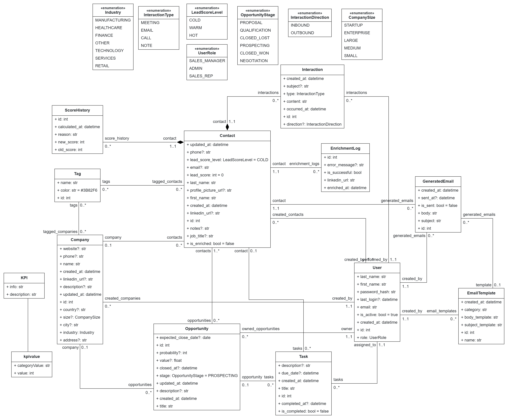

# NexaCRM - Raw Generated Output

An AI-powered CRM application **generated entirely by [BESSER](https://github.com/BESSER-PEARL/BESSER)** from a domain model, with no manual modifications. This branch represents the raw output of the BESSER WebApp generator.

> **See also:** The [v2_modified branch](https://github.com/ArmenSl/NexaCRM-BESSER/tree/v2_modified) extends this generated scaffold with custom features (authentication, AI lead scoring, email generation, and more).

## What is this?

This project demonstrates BESSER's code generation capabilities. Starting from a **B-UML class diagram** and a **GUI model** designed in the [BESSER online editor](https://editor.besser-pearl.org/), the platform generated:

- A **FastAPI backend** with full CRUD endpoints, SQLAlchemy ORM models, and Pydantic validation schemas
- A **React + TypeScript frontend** with data tables, charts, dashboards, and navigation
- **Docker** configuration for local deployment
- **Render** configuration for cloud deployment

**Zero lines of hand-written code** — everything in this branch comes directly from BESSER's WebApp generator.

## Tech Stack

| Layer | Technology |
|-------|------------|
| Backend | Python, FastAPI, SQLAlchemy, Pydantic |
| Frontend | React 19, TypeScript, Vite, Tailwind CSS, Recharts |
| Database | SQLite |
| Deployment | Docker Compose, Render |

## Domain Model

The application was generated from the following B-UML class diagram, designed in the [BESSER online editor](https://editor.besser-pearl.org/):



The B-UML model files are also available in the [`INFO/`](INFO/) folder.

## Getting Started

### With Docker (recommended)

```bash
docker-compose up --build
```

- Frontend: http://localhost:3000
- Backend API docs: http://localhost:8000/docs

### Without Docker

**Backend:**
```bash
cd backend
pip install -r requirements.txt
uvicorn main_api:app --host 0.0.0.0 --port 8000
```

**Frontend:**
```bash
cd frontend
npm install
npm run dev
```

## Project Structure

```
NexaCRM_RawEditor/
├── backend/
│   ├── main_api.py          # FastAPI app with all CRUD endpoints
│   ├── sql_alchemy.py       # SQLAlchemy ORM models
│   ├── pydantic_classes.py  # Request/response schemas
│   ├── requirements.txt
│   └── Dockerfile
├── frontend/
│   ├── src/
│   │   ├── pages/           # One page per entity (Contact, Company, ...)
│   │   ├── components/      # Tables, charts, agent chat
│   │   └── App.tsx          # Router and layout
│   ├── package.json
│   └── Dockerfile
├── INFO/                    # B-UML model files and documentation
├── docker-compose.yml
└── render.yaml              # One-click deploy to Render
```

## About BESSER

[BESSER](https://github.com/BESSER-PEARL/BESSER) is a low-code platform for smart software modeling. It uses model-driven engineering to generate full-stack applications from visual domain models.

- Documentation: https://besser.readthedocs.io/
- Online Editor: https://editor.besser-pearl.org/
